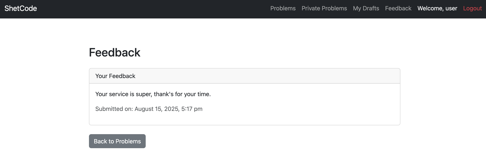

# ShetCode Documentation

- [Introduction](#introduction)
- [Architecture](#architecture)
- [Installation](#installation)
  - [Running the Service](#running-the-service)
  - [Running the Checker](#running-the-checker)
- [Usage](#usage)
  - [Landing Page](#landing-page)
  - [Registration](#registration)
  - [Login](#login)
  - [Problems](#problems)
    - [Browse and Filter](#browse-and-filter)
    - [Create](#create)
    - [Drafts](#drafts)
    - [Edit and Publish](#edit-and-publish)
    - [Private Problems and Access Control](#private-problems-and-access-control)
    - [Problem Details and Submissions](#problem-details-and-submissions)
  - [Feedback](#feedback)
  - [Admin Flow](#admin-flow)
    - [Admin Challenge](#admin-challenge)
    - [Admin Dashboard](#admin-dashboard)
    - [Admin Feedback View](#admin-feedback-view)
- [Flagstores](#flagstores)
  - [FS0: Draft Problem Descriptions](#fs0-draft-problem-descriptions)
  - [FS1: Saved Solution Files](#fs1-saved-solution-files)
  - [FS2: Feedback and Admin View](#fs2-feedback-and-admin-view)
- [Intended Exploits and Fixes](#intended-exploits-and-fixes)
  - [SQL Injection in Problems API](#sql-injection-in-problems-api)
  - [Sandbox Breakout via Code Execution](#sandbox-breakout-via-code-execution)
  - [Stored XSS via SVG in Admin Feedback](#stored-xss-via-svg-in-admin-feedback)
- [File Structure](#file-structure)
  - [Service](#service)
  - [Checker](#checker)
  - [Documentation Assets](#documentation-assets)

## Introduction

ShetCode is a [LeetCode](https://leetcode.com/)-like platform built with Symfony and PostgreSQL. It supports public/private coding problems, sandboxed Python execution, and feedback submission. It is designed as a CTF service with multiple flagstores and intended vulnerabilities.

## Architecture

- Web app: Symfony (PHP-FPM + Nginx)
- DB: PostgreSQL
- Cache: Redis (for application caching)
- Code execution: nsjail + Python3, per-submission directory under `public/submissions`

## Installation

### Running the Service

```bash
git clone https://github.com/enowars/enowars9-service-shetcode.git
enowars9-service-shetcode
cd service
# Optionally set secrets
export POSTGRES_DB=app
export POSTGRES_PASSWORD=postgres
export APP_SECRET=$(openssl rand -hex 32)

docker compose up --build -d
# Service: http://localhost:8055
```

### Running the Checker

```bash
git clone https://github.com/enowars/enowars9-service-shetcode.git
cd enowars9-service-shetcode
cd checker
docker compose up --build -d
# Checker HTTP: http://localhost:18055 (for ENOEngine)
```

## Usage

### Landing Page
- `GET /` → login/register page if not authenticated, else redirect to problems.


### Registration
- `POST /register` with `username`, `password`.
- Password hashing: `md5(password + 'ctf_salt_2024')` (not too weak for CTF, but tricking AI).

### Login
- `POST /login` with `username`, `password`.
- User sessions store `user_id`, `username`.
- Admins go through challenge step before becoming fully authenticated.

### Problems

#### Browse and Filter
- `GET /problems` renders problems list page; optional filter by `author_username`.
- `POST /api/problems` returns JSON list.


#### Create
- `GET /problems/create` renders form.
- `POST /problems/create` with:
  - `title` (<= 255), `description` (<= 1000), `difficulty` (easy, medium, hard)
  - `testCases` JSON array, `expectedOutputs` JSON array
  - `maxRuntime` (seconds, capped to 1)
  - `isPublished` boolean, `isPrivate` boolean
  - `accessUsers` comma-separated usernames (for private problems)


#### Drafts
- `GET /problems/drafts` lists user's unpublished problems.

#### Edit and Publish
- `GET /problems/{id}/edit`
- `POST /problems/{id}/edit`
- `POST /problems/{id}/publish`

#### Private Problems and Access Control
- `GET /private-problems` shows own and shared private problems.
- `GET /private-problems/details/{id}` checks author or explicit access via `PrivateAccess`.


#### Problem Details and Submissions
- `GET /problems/details/{id}` (or private variant) shows 0–2 example tests.
- Editor preloads last `solution.py` from `public/submissions/{userId}/{problemId or private_id}/`.
- `POST /problems/details/{id}/submit` saves new `solution.py` and executes Python code in nsjail.


### Feedback
- `GET /feedback` to view/submit own feedback.
- `POST /feedback/submit` with `description` and optional `image` (SVG/PNG/JPEG).
- `GET /feedback/image/{id}` returns image bytes with content-type detection.



### Admin Flow

#### Admin Challenge
- `GET /admin-challenge` returns base64 RSA-encrypted random string inside `<pre>`.
- Admin must decrypt using private key (checker has `admin_private.pem`) and submit within 10s.
- `POST /admin-challenge` with `decrypted_challenge` promotes session to authenticated admin.


#### Admin Dashboard
- `GET /admin` shows dashboard with current “time traveller” message and available functionality.


#### Admin Message
- `GET/POST /admin/message` shows/sets current message (wipes previous messages).


#### Admin Feedback View
- `GET /admin/feedback` lists all feedback; inlines uploaded image content.


## Flagstores

### FS0: Draft Problem Descriptions
- Stored in problem `description` when creating as draft.
- Retrieval path: owner visits `GET /problems/{id}/edit`.
- Exploit path: see SQL injection below to leak unpublished problems.
- [TODO] Add PoC snippet and sample screenshot

### FS1: Saved Solution Files
- User submission saved at `public/submissions/{user_id}/{problem_id}/solution.py`.
- Problem detail preloads prior solution; viewing reveals content.
- Exploit path: run Python to list/cat other users’ solutions via mounted `public/submissions`.
- [TODO] Add PoC snippet and sample screenshot

### FS2: Feedback and Admin View
- User `description` appears on admin feedback table.
- Uploaded SVG is inlined on admin page and can run scripts.
- Exploit path: XSS exfiltrates flags by creating a private problem shared with attacker.
- [TODO] Add PoC snippet and sample screenshot

## Intended Exploits and Fixes

This service contains 3 Flagstores:

### SQL Injection in Problems API
- Location: `App\DatabaseManager\FindProblemsByAuthorId::execute()` builds SQL with string concatenation of `author_username`.
- Impact: bypass `is_published = true`, leak drafts (FS0).
- Mitigation [TODO]: parameterized queries / QueryBuilder.
- PoC [TODO]: `author_username = anything' OR '1'='1' -- `

### Sandbox Breakout via Code Execution
- Location: `App\Service\CodeExecutor` mounts `public/submissions` read-only in nsjail and runs `/usr/bin/python3`.
- Impact: submitted code can read other users’ `solution.py` files (FS1).
- PoC [TODO]: `os.system('find /var/www/html/public/submissions -type f -name "solution.py" -exec cat {} \;')`
- Mitigation [TODO]: per-user chroot, remove global mount, separate storage per-tenant, better jail profile.

### Stored XSS via SVG in Admin Feedback
- Location: `templates/admin/feedback.html.twig` uses `{{ item.image|raw }}` to inline untrusted image bytes.
- Impact: arbitrary JS in admin context, used to exfiltrate flags into private problems (FS2).
- PoC [TODO]: SVG with `<script>`.
- Mitigation [TODO]: never inline untrusted data; serve via ``, sanitize SVG, enforce CSP, or convert to safe raster.

## File Structure

### Service
```
service
├── bin
│   └── console                      # Symfony console
├── composer.json                    # PHP dependencies
├── composer.lock
├── config                           # Symfony configuration
│   ├── bundles.php
│   ├── packages
│   │   ├── cache.yaml
│   │   ├── doctrine_migrations.yaml
│   │   ├── doctrine.yaml
│   │   ├── framework.yaml
│   │   ├── monolog.yaml
│   │   ├── routing.yaml
│   │   ├── security.yaml
│   │   ├── twig.yaml
│   │   └── web_profiler.yaml
│   ├── preload.php
│   ├── routes
│   │   ├── framework.yaml
│   │   ├── security.yaml
│   │   └── web_profiler.yaml
│   ├── routes.yaml
│   └── services.yaml
├── docker                           # Container configs and startup
│   ├── cleanup.sh                   # Trigger PHP cleanup task
│   ├── db-init.sql                  # DB initialization
│   ├── nginx.conf                   # Nginx vhost
│   ├── php-fpm.conf                 # PHP-FPM pool
│   └── start.sh                     # Entrypoint (runs nginx + php-fpm)
├── docker-compose.yml               # Service stack: php, postgres, redis
├── Dockerfile                       # Builds php-fpm + nsjail + app
├── migrations                       # Doctrine migrations (schema)
│   ├── Version20250501203901.php
│   ├── ...                          # More migration versions
├── public
│   └── index.php                    # Front controller
├── src                              # Application source code
│   ├── Command                      # CLI commands
│   │   ├── CreateSampleProblemsCommand.php
│   │   └── PurgeOldDataCommand.php  # Cleanup command
│   ├── Controller                   # HTTP endpoints
│   │   ├── AdminController.php
│   │   ├── FeedbackController.php
│   │   ├── LoginController.php
│   │   └── ProblemController.php
│   ├── DatabaseManager              # DB access helpers
│   │   └── FindProblemsByAuthorId.php
│   ├── Entity                       # Doctrine entities
│   │   ├── AdminMessage.php
│   │   ├── Feedback.php
│   │   ├── PrivateAccess.php
│   │   ├── PrivateProblem.php
│   │   ├── Problem.php
│   │   └── User.php
│   ├── EventSubscriber              # Session/Request subscribers
│   │   └── SessionTimeoutSubscriber.php
│   ├── Service                      # Domain services
│   │   ├── CodeExecutor.php         # nsjail-based Python runner
│   │   └── ImageHandler.php         # Image IO and response
│   └── Kernel.php                   # Symfony kernel
├── symfony.lock                     # Symfony dependencies
├── templates                        # Twig templates (views)
│   ├── admin
│   │   ├── admin_challenge.html.twig
│   │   ├── dashboard.html.twig
│   │   ├── feedback.html.twig
│   │   └── message.html.twig
│   ├── base.html.twig
│   ├── feedback
│   │   └── index.html.twig
│   ├── login
│   │   └── index.html.twig
│   └── problem
│       ├── create.html.twig
│       ├── detail.html.twig
│       ├── drafts.html.twig
│       ├── edit.html.twig
│       ├── list.html.twig
│       └── private_list.html.twig
└── README.md                        # Service deployment notes
```

### Checker
```
checker
├── docker-compose.yaml              # Checker + Mongo stack
├── Dockerfile                       # Checker container image
├── requirements.txt                 # Python dependencies
└── src
    ├── checker.py                   # Main checker code
    ├── admin_simulator.py           # Admin challenge + headless browser flow
    ├── title_generator.py           # Problem title generator
    ├── message_generator.py         # Admin message generator
    ├── svg_generator.py             # SVG/image generator
    └── gunicorn.conf.py             # Gunicorn config for checker
```